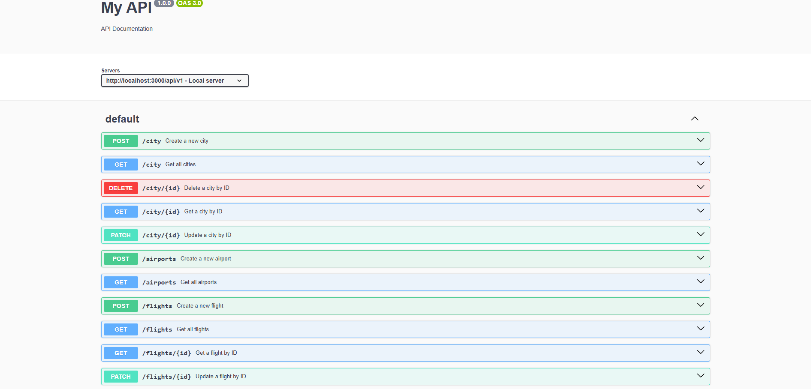

# Welcome to Flights Service

## Project Setup
- clone the project on your local
- Execute `npm install` on the same path as of your root directory of the downloaded project
- Create a `.env file` in the root directory and add the following environment variable
    - `PORT=3000`
- Inside the `src/config` folder create a new file config.json and then add the following piece of json

```
{
  "development": {
    "username": <YOUR_DB_LOGIN_NAME>,
    "password": <YOUR_DB_PASSWORD>,
    "database": "Flights_Search_DB_DEV",
    "host": "127.0.0.1",
    "dialect": "mysql"
  }
}

```
- Once you've added your db config as listed above, go to the src folder from your terminal and execute `npx sequelize db:create` and then execute
`npx sequelize db:migrate`

```
## DB Design
  - Airplane Table
  - Flight
  - Airport
  - City 

  - A flight belongs to an airplane but one airplane can be used in multiple flights
  - A city has many airports but one airport belongs to a city
  - One airport can have many flights, but a flight belongs to one airport

## Tables

### City -> id, name, created_at, updated_at
### Airport -> id, name, address, city_id, created_at, updated_at
    Relationship -> City has many airports and Airport belongs to a city (one to many)
npx sequelize model:generate --name Airport --attributes name:String,address:String,cityId:integer

# API Documentation

## Overview
This API provides endpoints for managing **Airports** and **Flights**. It supports operations such as creating, fetching, updating, and deleting records.

## Base URL
```
http://localhost:3000/api
```

## Endpoints

### ✈️ Airport Endpoints
| Method | Endpoint        | Description                         | Authentication |
|--------|---------------|-------------------------------------|---------------|
| POST   | /airports      | Create a new airport               | Required |
| GET    | /airports      | Get all airports                   | No |

---

### 🛫 Flight Endpoints
| Method | Endpoint       | Description                          | Authentication |
|--------|--------------|--------------------------------------|---------------|
| POST   | /flights      | Create a new flight                 | Required |
| GET    | /flights      | Get all flights                     | No |
| GET    | /flights/:id  | Get a specific flight by ID         | No |
| PATCH  | /flights/:id  | Update flight details by ID         | Required |

---

## Example Requests

### 1️⃣ Create an Airport
**Request:**
```json
POST /airports
{
  "name": "John F. Kennedy International Airport",
  "location": "New York, USA"
}
```

**Response:**
```json
{
  "message": "Successfully created the airport",
  "data": {
    "id": 1,
    "name": "John F. Kennedy International Airport",
    "location": "New York, USA"
  },
  "success": true
}
```

### 2️⃣ Fetch All Flights
**Request:**
```http
GET /flights
```

**Response:**
```json
{
  "message": "Successfully fetched the flights",
  "data": [
    {
      "id": 101,
      "flightNumber": "AA101",
      "departureAirport": "JFK",
      "arrivalAirport": "LAX",
      "departureTime": "2025-02-10T14:00:00Z",
      "arrivalTime": "2025-02-10T18:00:00Z",
      "price": 350
    }
  ],
  "success": true
}
```

---

## 🛡️ Authentication
Some endpoints require authentication (like creating an airport or a flight). Ensure to include a valid token in the `Authorization` header:
```http
Authorization: Bearer <your-token>
```

## 🚀 How to Run the API
1. Install dependencies:
   ```sh
   npm install
   ```
2. Start the server:
   ```sh
   npm start
   ```
3. Access the Swagger documentation:
   ```
   http://localhost:3000/api-docs
   ```


